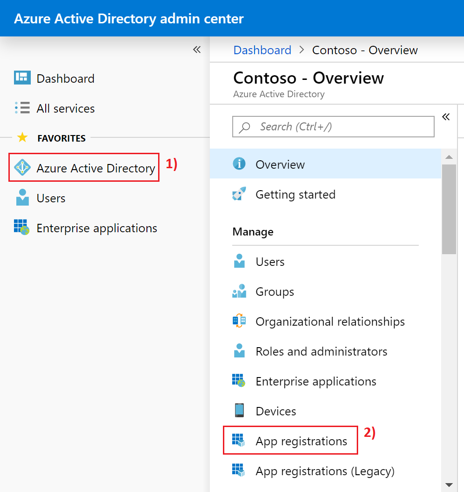
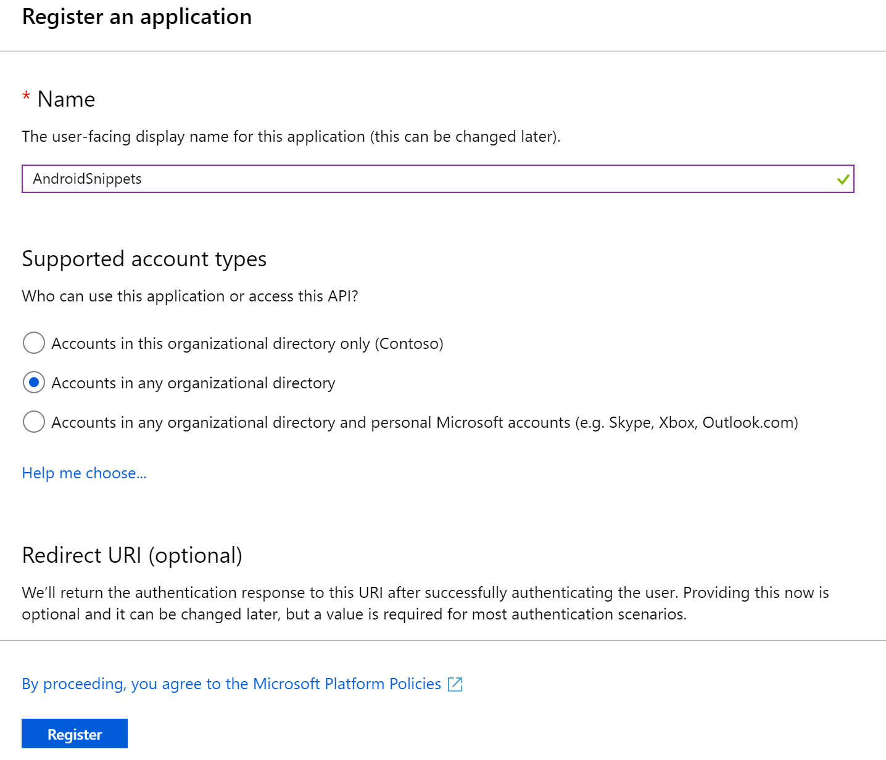
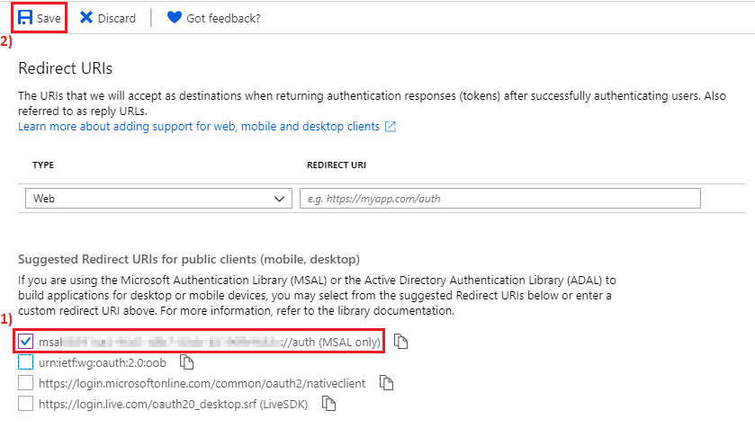

# Office 365 Android Microsoft Graph Snippets

**Table of contents**

* [Device requirement](#device-requirement)
* [Prerequisites](#prerequisites)
* [Azure client application registration](#azure-client-application-registration)
* [Configure the project](#configure-the-project)
* [Run the project](#run-the-project)
* [How the sample affects your tenant data](#how-the-sample-affects-your-tenant-data)
* [Understand the code](#understand-the-code)
* [Questions and comments](#questions-and-comments)
* [Contributing](#contributing)
* [Additional resources](#additional-resources)

Looking to build cool apps that help people work with their Office 365 data? Explore, learn, and understand the Microsoft Graph (previously called Office 365 unified API) REST APIs by using the Android Microsoft Graph API REST Snippets sample. This sample shows you how to access multiple resources, including Microsoft Azure Active Directory and the Office 365 APIs, by making HTTP requests to the Microsoft Graph API in an Android application.

You can explore the following operations for Office 365:

**Me**

* [Get information about the signed in user.](app/src/main/java/com/microsoft/office365/msgraphsnippetapp/snippet/MeSnippets.java#L46)
* [Get the user's responsibilities.](app/src/main/java/com/microsoft/office365/msgraphsnippetapp/snippet/MeSnippets.java#L59)
* [Get the user's manager.](app/src/main/java/com/microsoft/office365/msgraphsnippetapp/snippet/MeSnippets.java#L73)
* [Get the user's direct reports.](app/src/main/java/com/microsoft/office365/msgraphsnippetapp/snippet/MeSnippets.java#L87)
* [Get the user's photo.](app/src/main/java/com/microsoft/office365/msgraphsnippetapp/snippet/MeSnippets.java#L114)
* [Get the groups the user is a member of.](app/src/main/java/com/microsoft/office365/msgraphsnippetapp/snippet/MeSnippets.java#L100)

**Users**

* [Get users from your tenant's directory.](app/src/main/java/com/microsoft/office365/msgraphsnippetapp/snippet/UsersSnippets.java#L45)
* [Get users filtered by criteria from your tenant's directory.](app/src/main/java/com/microsoft/office365/msgraphsnippetapp/snippet/UsersSnippets.java#L59)
* [Create a new user.](app/src/main/java/com/microsoft/office365/msgraphsnippetapp/snippet/UsersSnippets.java#L76)

**Events**

* [Get the signed-in user's events from Office 365.](app/src/main/java/com/microsoft/office365/msgraphsnippetapp/snippet/EventsSnippets.java#L50)
* [Create a new event for the user.](app/src/main/java/com/microsoft/office365/msgraphsnippetapp/snippet/EventsSnippets.java#L65)
* [Update a user's event.](app/src/main/java/com/microsoft/office365/msgraphsnippetapp/snippet/EventsSnippets.java#L80)
* [Delete a user's event.](app/src/main/java/com/microsoft/office365/msgraphsnippetapp/snippet/EventsSnippets.java#L118)

**Messages**

* [Get user's messages from Office 365.](app/src/main/java/com/microsoft/office365/msgraphsnippetapp/snippet/MessageSnippets.java#L50)
* [Send a message from the user.](app/src/main/java/com/microsoft/office365/msgraphsnippetapp/snippet/MessageSnippets.java#L63)

**Contacts**

* [Get all contacts in the tenant.](app/src/main/java/com/microsoft/office365/msgraphsnippetapp/snippet/ContactsSnippets.java#L36)

**Groups**

* [Get all groups in your tenant's directory.](app/src/main/java/com/microsoft/office365/msgraphsnippetapp/snippet/GroupsSnippets.java#L123)
* [Create a new group.](app/src/main/java/com/microsoft/office365/msgraphsnippetapp/snippet/GroupsSnippets.java#L135)
* [Get information about a specific group in the tenant.](app/src/main/java/com/microsoft/office365/msgraphsnippetapp/snippet/GroupsSnippets.java#L47)
* [Update the description of a group.](app/src/main/java/com/microsoft/office365/msgraphsnippetapp/snippet/GroupsSnippets.java#L148)
* [Delete a group.](app/src/main/java/com/microsoft/office365/msgraphsnippetapp/snippet/GroupsSnippets.java#L181)
* [Get a group's members.](app/src/main/java/com/microsoft/office365/msgraphsnippetapp/snippet/GroupsSnippets.java#L70)
* [Get a group's owners.](app/src/main/java/com/microsoft/office365/msgraphsnippetapp/snippet/GroupsSnippets.java#L97)

**Drives**

* [Gets the signed-in user's drive.](/app/src/main/java/com/microsoft/office365/msgraphsnippetapp/snippet/DrivesSnippets.java#L53)
* [Gets all of the drives in your tenant.](/app/src/main/java/com/microsoft/office365/msgraphsnippetapp/snippet/DrivesSnippets.java#L65)
* [Gets all of the files in the user's root folder.](/app/src/main/java/com/microsoft/office365/msgraphsnippetapp/snippet/DrivesSnippets.java#L77)
* [Creates a new file in the user's root folder.](/app/src/main/java/com/microsoft/office365/msgraphsnippetapp/snippet/DrivesSnippets.java#L91)
* [Downloads a file from the user's root folder.](/app/src/main/java/com/microsoft/office365/msgraphsnippetapp/snippet/DrivesSnippets.java#L108)
* [Updates the contents of a file in the user's root folder.](/app/src/main/java/com/microsoft/office365/msgraphsnippetapp/snippet/DrivesSnippets.java#L142)
* [Deletes a file in the user's root folder.](/app/src/main/java/com/microsoft/office365/msgraphsnippetapp/snippet/DrivesSnippets.java#L177)
* [Renames a file in the user's root folder.](/app/src/main/java/com/microsoft/office365/msgraphsnippetapp/snippet/DrivesSnippets.java#L211)
* [Creates a folder under the user's root folder.](/app/src/main/java/com/microsoft/office365/msgraphsnippetapp/snippet/DrivesSnippets.java#L252)

## Device requirement
To run the Microsoft Graph API REST snippets project, your device must meet the following requirement:
* Android API level 21 or newer

### Prerequisites
To use the Microsoft Graph API REST snippets project, you need the following:
* The latest version of [Android Studio](http://developer.android.com/sdk/index.html).
* The [Gradle](http://www.gradle.org) build automation system version 5.1.1 or later.
* An Office 365 account. You can sign up for [an Office 365 Developer subscription](https://portal.office.com/Signup/Signup.aspx?OfferId=C69E7747-2566-4897-8CBA-B998ED3BAB88&DL=DEVELOPERPACK&ali=1#0) that includes the resources you need to start building Office 365 apps.
* [Java Development Kit (JDK) 7](http://www.oracle.com/technetwork/java/javase/downloads/jdk7-downloads-1880260.html).
* A registered Azure application with a client id and redirect URI value. See [Grant permissions to the Snippets application in Azure](../../wiki/Grant-permissions-for-the-Snippet-application-in-Azure) for details about how to create the correct permissions.

## Azure client application registration

1. Open a browser and navigate to the [Azure Active Directory admin center](https://aad.portal.azure.com). Login using a **Work or School Account**.

1. Select **Azure Active Directory** in the left-hand navigation, then select **App registrations** under **Manage**.

   

1. Select **New registration**. On the **Register an application** page, set the values as follows.

    - Set a preferred **Name** e.g. `AndroidSnippets`
    - Set **Supported account types** to **Accounts in any organizational directory**.

    

1. Choose **Register**. On the **AndroidSnippets** app page, select **Overview** and copy the value of the **Application (client) ID** and save it, you will need it in the next step.

    

1. Still on the app page, select **Authentication**. Locate the section **Redirect URIs**. In the _Suggested Redirect URIs for public clients(mobile,desktop)_, check the second box so that the app can work with the MSAL libraries used in the application. (The box should contain the option _msal<YOUR_CLIENT_ID>://auth_). Choose **Save**.

    
  
To learn about authenticating with MSAL for Android to make calls to Microsoft Graph, see [Call the Microsoft Graph API from an Android app](https://docs.microsoft.com/en-us/azure/active-directory/develop/guidedsetups/active-directory-android).

## Configure the project

1. Download or clone the [Android Microsoft Graph Snippets sample](../../).
2. Start Android Studio.
3. From the **Welcome to Android Studio** dialog box, choose **Import project (Eclipse ADT, Gradle, etc)**.
4. Select the **settings.gradle** file in the **O365-Android-Unified-API-Snippets** folder, and then click **OK**.
5. Respond to the dialog box ("Gradle Sync: Gradle settings for this project are not configured yet. Would you like the project to use the Gradle wrapper? ") by clicking the **OK** button to use the Gradle wrapper. 
6. Open the ServiceConstants.java file in the folder **java** > **com.microsoft.office365.msgraphsnippetapp**.
7. Find the **CLIENT_ID** string and replace the value *ENTER_YOUR_CLIENT_ID* with the Application (client) ID that you copied in the previous step.
8. Open the AndroidManifest.xml file in the **app** > **manifests** folder. 
1. Replace the *ENTER_YOUR_CLIENT_ID* with the Application (client) ID that you copied in the previous step.

## Run the project
After you've built the project you can run it on an emulator or device.

1. Run the project.
2. Click the **Connect to Office 365** button to sign in to Office 365.
3. Enter your credentials.
4. Review and accept the permission scopes requested by the app.
4. Click a REST operation in the main activity to show operation details.
5. Click the **RUN** button to start the REST operation and wait for the operation to finish.
6. Click in the **Response Headers** or **Response Body** text boxes to copy the box contents to the emulator/device clipboard.
7. Click the back button on the REST Explorer toolbar to return to the REST operation list.
8. (Optional) Click the overflow menu to get the Disconnect menu option.

## How the sample affects your tenant data
This sample runs REST commands that create, read, update, or delete data. When running commands that delete or edit data, the sample creates fake entities. The fake entities are deleted or edited so that your actual tenant data is unaffected. The sample will leave behind fake entities on your tenant.

## Understand the code
The Office 365 Android unified API snippets project uses these classes to manage interactions with the Microsoft Graph API on Office 365:
### Sample project organization
The Office 365 Android unified API snippets project is comprised of three modules. The modular design enables you to build a new app based on this sample by importing the modules into your app. After you've imported the modules, use the code in the Office 365 Android unified API snippets [app](/app) module as an example of how to call methods in the other sample modules.

### Modules in the Office 365 Android unified API snippets project
* [`o365-Auth`](/o365-auth). This module contains the library calls to authenticate a user with Office 365.
* [`unifiedapi`](/unifiedapi). This module encapsulates the Retrofit REST operations used for the Office 365 Microsoft Graph API endpoint.
* [`app`](/app). The UI and business logic module. REST operations are started in the snippet classes in this module.

### Snippet classes
A snippet runs a single REST operation and returns the results. Snippets are found in the [app](/app) module. Snippets set the state required to make the calls on the Microsoft Graph API service classes described below.
* [`ContactsSnippets`](/app/src/main/java/com/microsoft/o365_android_unified_api_snippets/snippet/ContactsSnippets.java)
* [`EventsSnippets`](/app/src/main/java/com/microsoft/o365_android_unified_api_snippets/snippet/EventsSnippet.java)
* [`GroupsSnippets`](/app/src/main/java/com/microsoft/o365_android_unified_api_snippets/snippet/GroupsSnippets.java)
* [`AbstractSnippet`](/app/src/main/java/com/microsoft/o365_android_unified_api_snippets/snippet/AbstractSnippet.java)

### Microsoft Graph API service classes
These classes are found in the [unifiedapi](/unifiedapi) module and make the Retrofit library calls that generate the REST queries and handle operation results. These service classes are consumed by the snippets.
* [`MSGraphContactService`](/microsoftgraphapi/src/main/java/com/microsoft/unifiedapi/service/MSGraphContactService.java)
* [`MSGraphEventsService`](/microsoftgraphapi/src/main/java/com/microsoft/unifiedapi/service/MSGraphEventsService.java)
* [`MSGraphGroupsService`](/microsoftgraphapi/src/main/java/com/microsoft/unifiedapi/service/MSGraphGroupsService.java)
* [`MSGraphMailService`](/microsoftgraphapi/src/main/java/com/microsoft/unifiedapi/service/MSGraphMailService.java)
* [`MSGraphUserService`](/microsoftgraphapi/src/main/java/com/microsoft/unifiedapi/service/MSGraphUserService.java)

### Authentication classes for Office 365 business accounts
The authentication classes are found in the [o365-Auth](/o365-auth) module. These classes use the [Microsoft Azure Active Directory Library (ADAL) for Android](../../../../AzureAD/azure-activedirectory-library-for-android) to connect to a business version of Office 365 such as Office 365 Enterprise. 

* [`AuthenticationManager`](/o365-auth/src/main/java/com/microsoft/o365_auth/AuthenticationManager.java). Encapsulates user connect and disconnect logic in addition to Azure app authorization.
* [`AzureADModule`](/o365-auth/src/main/java/com/microsoft/o365_auth/AzureADModule.java). Authentication helper class. 
* [`AzureAppCompatActivity`](/o365-auth/src/main/java/com/microsoft/o365_auth/AzureAppCompatActivity.java). Dependency injection helper.

## Questions and comments
We'd love to get your feedback about the Android Microsoft Graph API REST Snippets sample. You can send your feedback to us in the [Issues](../../issues) section of this repository.  
General questions about Office 365 development should be posted to [Stack Overflow](http://stackoverflow.com/questions/tagged/Office365+API). Make sure that your questions are tagged with [Office365] and [API].

## Contributing ##

If you'd like to contribute to this sample, see [CONTRIBUTING.MD](/CONTRIBUTING.md).

This project has adopted the [Microsoft Open Source Code of Conduct](https://opensource.microsoft.com/codeofconduct/). For more information see the [Code of Conduct FAQ](https://opensource.microsoft.com/codeofconduct/faq/) or contact [opencode@microsoft.com](mailto:opencode@microsoft.com) with any additional questions or comments. 

## Additional resources

* [Office 365 Microsoft Graph API documentation](https://graph.microsoft.io/docs)
* [Microsoft Graph Portal](https://graph.microsoft.io/)
* [Microsoft code samples](https://graph.microsoft.io/en-us/code-samples-and-sdks)

## Copyright
Copyright (c) 2019 Microsoft. All rights reserved.
